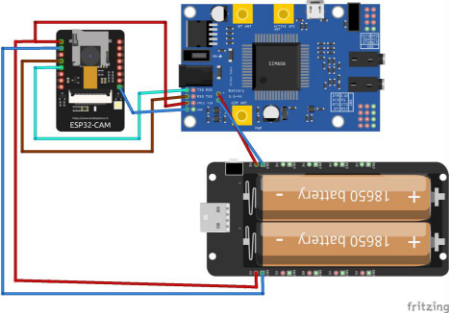
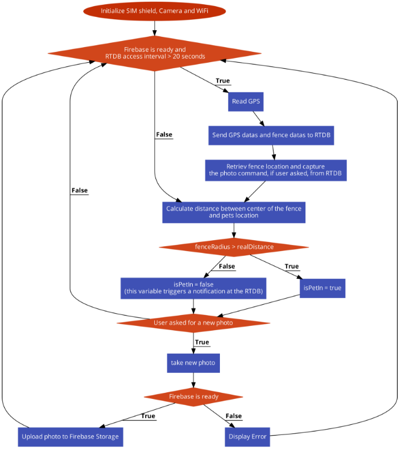

## Term Project Report

**Introduction**

This project aims to track your pet’s location, know when it went out of your predetermined area(home, garden, park etc.), and also check the pet’s environment. The significance of this project is that it uses a cellular network, so it does not need any other device to be near to send its location to the database. Because of using a cellular network, the project needs to be powered. I have used Li-on batteries for powering it. 

**Goals**

- Determine and upload location to a Real-Time Database 
- Take photos when the user wanted 
- Upload photos to a cloud storage 
- Notify if the location is out of the predetermined area 
- Use cellular network for communication 

**Software**  

- Arduino IDE 2.x.x 
- Visual Studio Code 
- Github 
- Firebase RTDB and Storage 

## Project Schema

 ## Control Flow Chart 

## Results 

The project successfully tracks location, sends notifications if the pet is out of the area and takes photos if the user asks. However, it does not use a cellular network yet. When I used GPRS and GNSS simultaneously this creates a conflict and gives UART driver errors. I think asynchronous programming can solve this problem and I will work on it. Until that time project will use WiFi for communication. 
